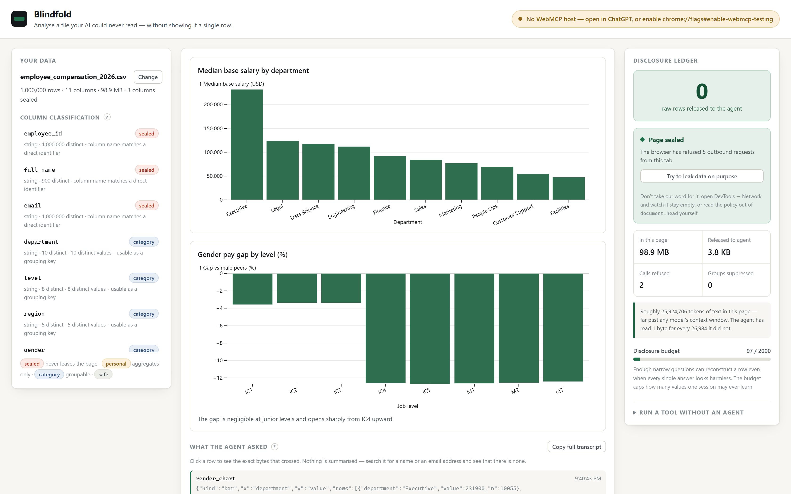

# Blindfold

**Analyse a file your AI could never read — without showing it a single row.**

**Live: <https://beeeeen.github.io/blindfold/>**

A 99 MB spreadsheet is about 26 million tokens. No model can read that. Paste a
fraction of it and you get an answer about a fraction of your data; upload the
whole thing and you have handed over every name and salary in it.

Blindfold does neither. The file opens inside your browser tab, the agent gets
tools instead of rows, and it directs an analysis over data it is structurally
unable to see.

| A million rows, 99 MB | |
|---|---|
| Read and classified | 3.2 s |
| Median salary by department | 0.07 s |
| Pay gap by level, both cohorts k-checked | 0.13 s |
| Bonus by level × region × department | 0.09 s |
| **Sent to the agent** | **27 KB — about 6,800 tokens** |
| **Raw rows sent to the agent** | **0** |

One byte reached the agent for every 3,799 that did not. Measured, not
estimated: `npm run test:scale`.



---

## The problem

Two walls, and every real dataset hits both.

**The context window.** Anything worth analysing is bigger than a model can
read. The usual workaround is to paste a sample, which answers a question about
the sample rather than about your data.

**The upload.** Every organisation with data worth analysing has a rule against
pasting it into a chatbot, and the rule is correct: it means handing over every
row, every name, every salary, to learn a single number.

So the analysis doesn't happen, or it happens badly in a spreadsheet, by somebody
with better things to do.

The two walls have the same door. If the agent never reads the rows, the file
can be any size *and* nothing has to be disclosed. Those stop being two features
and become one.

## The idea

WebMCP tools execute **inside the page**, in the user's own browser tab. That is
not a convenience — it is a different trust model. The data can stay in memory
that the agent has no way to address, while the agent still directs the analysis
through tools it *can* call.

Blindfold makes that concrete:

- The file is read into [DuckDB-WASM](https://duckdb.org/docs/api/wasm/overview)
  inside the tab. There is no server. There is no `fetch` of user data anywhere
  in this codebase.
- Every column is graded for re-identification risk before the agent is told it
  exists.
- The agent gets eight structured tools. **None of them accepts SQL.** It fills
  in narrow specs; the page compiles them to queries it controls.
- Every grouped result is passed through k-anonymity suppression before it is
  allowed to become a tool return value.
- A running ledger shows the human exactly how many bytes went in and how few
  came out, with the exact text of every answer kept verbatim.
- Once the engine has booted, the page **revokes its own network access** with a
  Content Security Policy, so the guarantee is enforced by the browser rather
  than asserted by the app.

The design rule throughout: **a leak should be impossible to express, not merely
refused after the fact.**

---

## How it works

### 1. Columns are graded before the agent hears about them

| Tier | Meaning | What the agent may do |
|---|---|---|
| `sealed` | Points at one human — name, email, employee ID | Nothing. It cannot group by it, filter on it, measure it, or receive it. |
| `personal` | A personal measurement — salary, balance, score | Aggregate it only. Never group by it, never match it exactly. |
| `category` | A grouping dimension — department, region, level | Group and filter, subject to k-anonymity. |
| `safe` | Everything else | Anything. |

Grading is heuristic — column names, cardinality, type — and heuristics are
wrong sometimes, so **every grade is one click to change** in the UI. Changing
one re-registers the whole toolset immediately, with new descriptions.

### 2. The agent cannot write a query, only fill in a form

There is no `run_sql` tool, deliberately. Free-form SQL cannot be proven
non-disclosive without a full parser and a lot of hope. Instead:

| Tool | Returns |
|---|---|
| `describe_dataset` | Schema, tiers and the rules. No values at all. |
| `list_group_values` | Distinct categories and their counts. |
| `aggregate` | One aggregate, optionally grouped and filtered. |
| `distribution` | Histogram bucket counts. Edges, not contents. |
| `correlate` | A Pearson coefficient and a sample size. |
| `compare_groups` | Two cohort means, the gap, and an effect size. |
| `render_chart` | Nothing. It draws on the human's screen. |
| `policy_report` | What this session has and has not disclosed. |

### 3. Refusals teach

A refusal is returned to the agent as a usable answer, not an exception, so it
can correct itself in one turn:

```
Refused by the disclosure guard.

min/max on "base_salary" would return one real person's exact value.

What to do instead: Use p25, median or p75 — they describe the same
shape without exposing an individual.
```

### 4. Thin groups are suppressed

Any group covering fewer than **k = 5** people is dropped before the agent sees
it. `compare_groups` is stricter still: *both* cohorts must independently clear
k, because a "gap" computed over two people is just those two people's salaries
with extra steps.

### 5. The page revokes its own network access

A ledger reading "nothing left this tab" is the page marking its own homework.
So it doesn't stop there. Once the engine has booted, Blindfold injects a
Content Security Policy that takes away its own ability to reach the network:

```
connect-src 'none'; form-action 'none'; img-src data:;
media-src 'none'; object-src 'none'; frame-src 'none'
```

From that moment the **browser** refuses every outbound channel — `fetch`,
`XMLHttpRequest`, WebSocket, `sendBeacon`, tracking pixels, form posts.
Not the app promising; the browser enforcing. Policies compose by intersection,
so this can only tighten what the document already allowed, and nothing here
needs the network after startup.

There is a **Try to leak data on purpose** button in the ledger panel that
attempts all five channels and shows you what the browser did with each. And
three ways to check without trusting any of the above:

| Check | What it proves |
|---|---|
| DevTools → Network, then use the app | Nothing goes out, at all |
| `document.querySelector('meta[http-equiv="Content-Security-Policy"]').content` | Read the policy yourself |
| DevTools → Console during the leak test | The browser logging its own refusals |

### 6. The transcript is the receipt, not a summary

Every tool call is recorded with the exact text that went back to the agent,
character for character. Click any row in *What the agent asked* to read it, or
**Copy full transcript** for the whole session.

That is the answer to "how do I know the AI didn't get my data": don't take the
counter's word for it — read every byte that crossed and search it for a name.
`npm run test:seal` does exactly that automatically, running a full analysis and
then grepping the transcript for emails, employee IDs and person names from the
source data.

### 7. `render_chart` is a one-way mirror

The agent supplies rows it already has and a shape to draw. The chart appears on
the human's screen. What the agent receives back is the word "drawn".

This is the part that only works because the tool runs in the page. A
server-side agent cannot show a person something without first holding it
itself.

---

## Try it

```bash
npm install
npm run dev
```

Then open the page in **ChatGPT's built-in browser** (desktop app, latest
version, GPT-5.6 Sol or Terra), or in **Chrome 146+** with
`chrome://flags/#enable-webmcp-testing` set to Enabled. Turning on
`chrome://flags/#devtools-webmcp-support` as well lets you inspect the
registered tools in DevTools. Verified working on Chrome 152.

Click **Use sample payroll** — it generates 50,000 synthetic employee records in
the tab. Then ask your agent:

> Where is pay least equitable in this company, and show me a chart of it.

It will find that the gender pay gap runs about 3% at IC1-IC3 and 12-14% from
IC4 upward — without ever having seen a salary.

**Want it as a file?** `npm run sample` writes the same 50,000 rows to
`sample-data/employee_compensation_2026.csv` so you can drag it in, or open it in
a spreadsheet to see what you would otherwise have been uploading. Pass a row
count to make it smaller: `npm run sample -- 5000`.

**No agent handy?** Open *Run a tool without an agent* in the ledger panel and
call the same tools by hand. The whole app is reviewable without a WebMCP host.

### Tests

```bash
npm run build
npm run preview      # in one terminal

npm test             # 29 checks: engine, classifier, guard, charts, ledger
npm run test:live    # 14 checks: against Chrome's real WebMCP implementation
npm run test:coverage # 33 checks: user files, every chart kind, every refusal
npm run test:seal    # 19 checks: the seal holds, and the transcript names nobody
npm run test:race    # 5 runs: clicking before the engine has finished booting
npm run test:all     # all of the above

npm run sample -- 1000000   # write the 99 MB file
npm run test:scale          # 8 checks: a million rows, timings, the ratio
```

`npm test` drives a real Chrome and asserts that the compiled SQL runs, that the
classifier grades the sample correctly, and that each thing the guard claims to
refuse is actually refused.

`npm run test:live` launches Chrome with `--enable-features=WebMCP` and goes
through the browser's own API rather than the page's internals: that
`getTools()` lists all eight with their schemas, that `executeTool()` returns
real results, and that refusals reach the host intact. It also covers
re-registration, which is where the interesting bug was — Chrome 152 ships no
`unregisterTool`, so replacing a toolset means aborting the previous batch's
`AbortSignal`. Without that, reclassifying one column throws
`InvalidStateError: Duplicate tool name` and silently strands the agent with
tools describing a file that is no longer loaded.

---

## What this does *not* do

Being straight about the limits, because a privacy tool that oversells itself is
worse than none:

- **This is k-anonymity, not differential privacy.** No noise is added.
  A determined adversary with outside knowledge can still learn things from a
  long series of legal queries. The disclosure budget (2,000 values per session)
  is a blunt backstop against exactly that, not a proof.
- **The classifier is a heuristic.** It reads column names and cardinality. A
  sensitive column with an innocuous name will be graded wrong. That is why the
  override exists, and why the tiers are shown on screen rather than hidden.
- **Column *names* are metadata the agent does see.** If your column is called
  `hiv_status`, the agent learns that such a column exists, though never who is
  in it.
- **`min`/`max` are blocked on personal measurements but allowed elsewhere**, so
  a column graded `category` by mistake can still leak an extreme value.
- **The seal does not cover top-level navigation.** CSP has no shipped directive
  that stops a page sending itself to `https://elsewhere/?data=…`, so that one
  channel remains open in principle. It is not a silent one — the tab would
  visibly leave the page in front of you — but it is a real gap and it would be
  dishonest to draw the box without it.
- **The seal binds the page, not the agent.** It guarantees your rows never
  leave this tab. What the agent does with the aggregates it legitimately
  received is between you and your agent — and the transcript is there so you
  can see exactly what that was.
- **The guarantee is about the agent, not about your device.** Data stays in
  your tab; it does not stay secret from anything else running on your machine.

---

## Stack

- [DuckDB-WASM](https://duckdb.org/docs/api/wasm/overview) — the query engine, in the tab
- [Observable Plot](https://observablehq.com/plot/) — charts
- [WebMCP](https://github.com/webmachinelearning/webmcp) — the agent surface
- Vite + TypeScript, no framework, no backend

```
src/
  db.ts         DuckDB-WASM: ingest and raw query. No network calls, by design.
  classify.ts   Grades each column for re-identification risk.
  guard.ts      Compiles specs to SQL; suppresses thin groups. The heart of it.
  tools.ts      The eight WebMCP tools, re-registered per dataset.
  chart.ts      The one-way mirror.
  ledger.ts     Byte accounting.
  sample.ts     Synthetic payroll, generated in-page so no real records ship.
```

## Licence

MIT — see [LICENSE](LICENSE).

Built for the [OpenAI WebMCP Challenge](https://openai.com/webmcp-challenge/).
